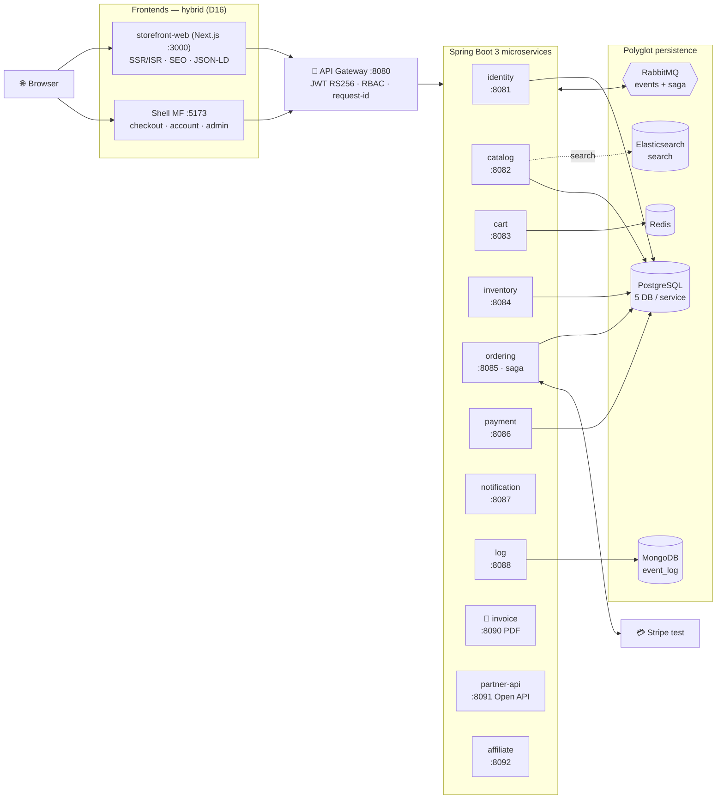
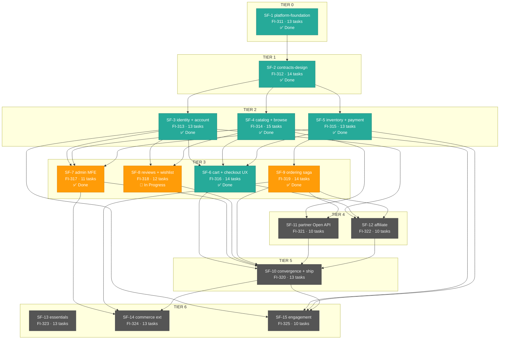

<div align="center">

# 🛒 Ecommerce Platform

**Website thương mại điện tử đầy đủ tính năng — kiến trúc microservices + micro frontends**

Storefront lấy cảm hứng UX từ [tiki.vn](https://tiki.vn) · Thanh toán Stripe test · Checkout saga phân tán

          

🚧 **Đang xây dựng** — story [FI-310](https://linear.app/my-app-hoivu/issue/FI-310) · **15 sub-features · 7 tier · release 5 phase** · [📊 Tiến độ](#-tiến-độ-story) · [🚢 Release plan](#-release-plan--5-phases)

</div>

---

## 🏗️ Kiến trúc



**Nguyên tắc:** database-per-service (cấm cross-DB join) · contract-first (OpenAPI freeze trước khi code) · transactional outbox + idempotent consumers · saga orchestration có compensation · event schema additive-only.

---

## 🧩 Services

| Service | Port | Trách nhiệm | Datastore |
|---|---|---|---|
| `gateway` | 8080 | Routing, JWT verify, RBAC guard, request-id, CORS, serve static MFE (prod) | — |
| `identity` | 8081 | Đăng ký/đăng nhập, JWT RS256, refresh rotation, JWKS | `db_identity` |
| `catalog` | 8082 | Products · categories · variants · **search (ES chính + PG FTS fallback)** · reviews · wishlist · cache | `db_catalog` + ES |
| `cart` | 8083 | Guest cart (cart_token), user cart, merge-on-login | Redis |
| `inventory` | 8084 | Stock theo variant, reservation TTL 30' all-or-nothing | `db_inventory` |
| `ordering` | 8085 | Orders, **checkout saga**, coupons, state machine, admin stats | `db_ordering` |
| `payment` | 8086 | Stripe test (intent/webhook/refund), `PaymentProviderAdapter` SPI | `db_payment` |
| `notification` | 8087 | Email (Mailpit): xác nhận/hủy đơn, review | `db_notification` |
| `log` | 8088 | Fan-in **mọi domain event** → Mongo `event_log` (audit trail) | MongoDB |
| `invoice` 🐍 | 8090 | **Python (FastAPI + ReportLab)** — stateless PDF renderer hóa đơn VN (internal-only) | — |
| `partner-api` | 8091 | **Open API cho đối tác** `/open-api/v1/**`: API key + rate-limit, catalog/orders, webhook HMAC, docs portal | `db_partner` |
| `affiliate` | 8092 | Affiliate: ref code, attribution 30 ngày, ledger hoa hồng | `db_affiliate` |

## 🖥️ Micro frontends

| App | Vai trò |
|---|---|
| `storefront-web` | **Next.js SSR/ISR (SEO)**: home (hero, flash deal countdown) · PLP kiểu Tiki · PDP (JSON-LD Product + OG) · search · coupon center · sitemap/robots |
| `shell` | MF host (app pages cần auth): layout, routing, auth context, header slots (auth/cart-badge) |
| `mfe-checkout` | Cart · checkout 3 bước · coupon · Stripe.js confirm · cart badge |
| `mfe-account` | Login/register · profile · my orders · wishlist · reviews |
| `mfe-admin` | Dashboard KPI + charts · products/categories CRUD (có trường SEO) · coupons · moderation · orders |

**Shared packages:** `contracts` (OpenAPI → TS codegen) · `auth` (token singleton federation-shared) · `ui-kit` (2 theme) · `i18n` (vi/en) · `config`.

---

## ✨ Tính năng MVP

| Storefront | Admin | Kiến trúc nổi bật |
|---|---|---|
| Duyệt/search/filter/sort kiểu Tiki | Dashboard KPI + biểu đồ | **Checkout saga** 4 services, 4 compensation edges |
| Flash deal countdown, badge giảm giá | Products/categories CRUD → thấy ngay trên storefront | **Polyglot persistence** — đúng DB cho đúng việc |
| Giỏ hàng guest + merge-on-login | Coupons CRUD (%, fixed, window, limit) | **Swap engine không đổi contract** — ES↔PG FTS, Stripe↔PSP khác |
| Checkout + Stripe test + email | Reviews moderation + badge "Mua đã xác nhận" | Event audit trail trên Mongo |
| **PDP chuẩn SEO**: SSR + JSON-LD Product + OG + sitemap | SEO override per-product (seoTitle/description/slug) | **Hybrid rendering**: Next.js SSR (SEO) + Vite MF (app) |
| **Đa ngôn ngữ vi/en** — kể cả dữ liệu sản phẩm (`/en/*` + hreflang) | Form sản phẩm tabs vi/en, fallback tự động | **i18n data**: JSONB {vi,en} trong Postgres, ES index per-locale |
| **Open API đối tác**: `/open-api/v1` API key + webhook HMAC + docs portal | Quản lý affiliate: duyệt, rate, stats | **Affiliate**: ref link, attribution 30 ngày, ledger hoa hồng event-driven |
| **COD** + **RMA đổi trả refund Stripe** + **GHN shipping** có tracking | **Loyalty điểm** earn 1% / burn checkout | **Login Google/Facebook + 2FA TOTP**, stock alert email, PWA + dark mode, live chat |
| My orders / wishlist / reviews · **tải hóa đơn PDF** | Orders: ship/deliver/cancel + low-stock + **tải hóa đơn** | **Polyglot**: Python (FastAPI/ReportLab) PDF service — stateless renderer tách khỏi business |
| — | **Email cảm ơn** kèm hóa đơn PDF khi mua hàng | RBAC server-side 2 lớp (gateway + service) |

---

## 🚀 Getting started

> ⚙️ Services + FE apps đang được xây dần theo từng SF — dưới đây là lệnh THẬT
> của nền móng (SF-1): infra + service template + gateway + FE workspace.

```bash
# Yêu cầu: JDK 21 · Maven 3.9+ · Docker Desktop · Node 20+ · pnpm 10 (corepack enable)
cp .env.example .env        # điền STRIPE_SECRET_KEY (sk_test_...) để bật payment

make infra                  # postgres (5 DB) · redis · rabbitmq · mailpit · mongo · elasticsearch
cd backend && mvn install -DskipTests && cd ..   # lần đầu: đẩy parent + common-lib vào ~/.m2

make dev svc=template-service   # chạy 1 service dev mode (template | gateway | identity | ...)
make dev svc=gateway            # smoke: http://localhost:8080/api/smoke

pnpm -C frontend install && pnpm -C frontend build   # FE workspace (turbo)
```

**Port DB:** postgres host = **5433** (container nội bộ 5432; máy dev có postgres
compose khác giữ 5432) — đổi bằng `PG_HOST_PORT` trong `.env`.

**Infra UIs:** RabbitMQ `:15672` · Mailpit `:8025` · mongo-express `:8089` · Elasticsearch `:9200` · stripe-cli (profile `stripe`)

**Make targets khác:** `make dev-fe app=<name>` · `make keys` (RSA keypair JWT, SF-3) · `make down` · `make full` (stub — SF-10)

**🔑 Tài khoản demo (seed SF-3 — idempotent từ env `ADMIN_EMAIL`/`ADMIN_PASSWORD` trong `.env.example`):**

| Vai trò | Email | Mật khẩu | Ghi chú |
|---|---|---|---|
| **Admin** | `admin@ecommerce.local` | `admin123` | vào `/admin` (shell `:5173`) — products/categories CRUD live, dashboard |
| Customer | tự đăng ký tại `/register` | — | vào `/admin` sẽ thấy trang 403 (RBAC guard UI) |

> Shell (mọi MFE): `http://localhost:5173` — login → menu user → hoặc gõ thẳng `/admin`.
> Admin standalone dev: `http://localhost:5177` (proxy `/api` qua `GATEWAY_URL`, mặc định `:8080`).

---

## 🧱 Bracket — 15 SF · 7 tier



> Bản render tương tác (hết hạn ~30 ngày): [share.onorca.dev/a/YghPe0uD5FEQ](https://share.onorca.dev/a/YghPe0uD5FEQ) · Nguồn: [`docs/superpowers/brackets/fi310-ecommerce-platform.md`](docs/superpowers/brackets/fi310-ecommerce-platform.md)

## 📊 Tiến độ story

| SF | Nội dung | Issue | Trạng thái |
|---|---|---|---|
| SF-1 | Nền móng: monorepo, compose, gateway, service template | [FI-311](https://linear.app/my-app-hoivu/issue/FI-311) | ✅ Done |
| SF-2 | Contracts freeze (10 OpenAPI + events), ui-kit, federation harness, design direction | [FI-312](https://linear.app/my-app-hoivu/issue/FI-312) | ✅ Done |
| SF-3 | Identity + account | [FI-313](https://linear.app/my-app-hoivu/issue/FI-313) | ✅ Done |
| SF-4 | Catalog + browse Tiki-style (storefront **Next.js SSR**) + Elasticsearch | [FI-314](https://linear.app/my-app-hoivu/issue/FI-314) | ✅ Done |
| SF-5 | Inventory + payment services | [FI-315](https://linear.app/my-app-hoivu/issue/FI-315) | ✅ Done |
| SF-6 | Cart + checkout UX | [FI-316](https://linear.app/my-app-hoivu/issue/FI-316) | ✅ Done |
| SF-7 | Admin MFE | [FI-317](https://linear.app/my-app-hoivu/issue/FI-317) | ✅ Done |
| SF-8 | Reviews + wishlist | [FI-318](https://linear.app/my-app-hoivu/issue/FI-318) | 🔨 In Progress |
| SF-9 | Ordering saga + coupons | [FI-319](https://linear.app/my-app-hoivu/issue/FI-319) | ✅ Done |
| SF-10 | Convergence + E2E + ship | [FI-320](https://linear.app/my-app-hoivu/issue/FI-320) | ⏳ Todo |
| SF-11 | Partner Open API (`/open-api/v1`) | [FI-321](https://linear.app/my-app-hoivu/issue/FI-321) | ✅ Done |
| SF-12 | Affiliate module | [FI-322](https://linear.app/my-app-hoivu/issue/FI-322) | ✅ Done |
| SF-13 | Essentials: password reset, COD, MinIO upload, abandoned cart, audit viewer, related, GA4, CSV, newsletter | [FI-323](https://linear.app/my-app-hoivu/issue/FI-323) | ⏳ Todo |
| SF-14 | Commerce extensions: RMA đổi trả, GHN shipping, loyalty điểm | [FI-324](https://linear.app/my-app-hoivu/issue/FI-324) | ⏳ Todo |
| SF-15 | Engagement: social login + 2FA, stock alert, PWA + dark mode, live chat | [FI-325](https://linear.app/my-app-hoivu/issue/FI-325) | ⏳ Todo |

---

## 🚢 Release plan — 5 phases

Release **từng phase một**: phase xong → tag + GitHub Release trên repo; merge `main` do người quyết định ở mỗi phase.

| Phase | Nội dung | Release khi |
|---|---|---|
| **P1** Foundation | Nền móng + contracts freeze + design direction + federation harness | SF-1 ✅ + SF-2 xong | ✅ **[phase-1 released + merged main](https://github.com/wakii-dev/ecommerce/releases/tag/phase-1)** |
| **P2** Catalog & Identity | Đăng ký/đăng nhập · storefront Next.js SEO · search ES · tồn kho + Stripe nền | SF-3 ✅ + SF-4 ✅ + SF-5 ✅ | ✅ **[phase-2 released + merged main](https://github.com/wakii-dev/ecommerce/pull/2)** |
| **P3** Transaction MVP | Giỏ → checkout (coupon, Stripe/COD) → saga → đơn + hóa đơn PDF · admin vận hành | SF-6 ✅ + SF-7 ✅ + SF-9 ✅ | ✅ **[phase-3 released](https://github.com/wakii-dev/ecommerce/releases/tag/phase-3)** |
| **P4** Growth & Partners | Reviews + wishlist · partner Open API + webhooks · affiliate hoa hồng | SF-8 ✅ + SF-11 ✅ + SF-12 ✅ | ✅ **[phase-4 released](https://github.com/wakii-dev/ecommerce/releases/tag/phase-4)** |
| **P5** Complete v1 | Convergence E2E · notification + essentials · RMA/GHN/loyalty · social/2FA/PWA/dark/chat | SF-10 + SF-13 + SF-14 + SF-15 |

## 📚 Tài liệu

| | |
|---|---|
| 📐 **Epic spec** | [`docs/superpowers/specs/2026-09-06-ecommerce-platform-design.md`](docs/superpowers/specs/2026-09-06-ecommerce-platform-design.md) — kiến trúc, decision log D1-D15, success criteria, saga design |
| 🧱 **Bracket** | [`docs/superpowers/brackets/fi310-ecommerce-platform.md`](docs/superpowers/brackets/fi310-ecommerce-platform.md) — 10 SF × 5 tier |
| 📦 **Context packs** | [`docs/superpowers/contexts/`](docs/superpowers/contexts/) — spec slice per SF |
| 🗂 **ADR** | `docs/adr/` — quyết định kiến trúc chi tiết (SF-10 hoàn thiện) |
